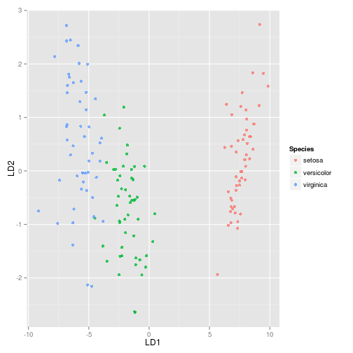
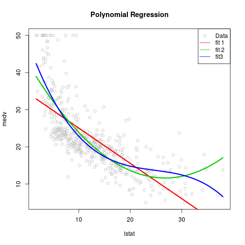
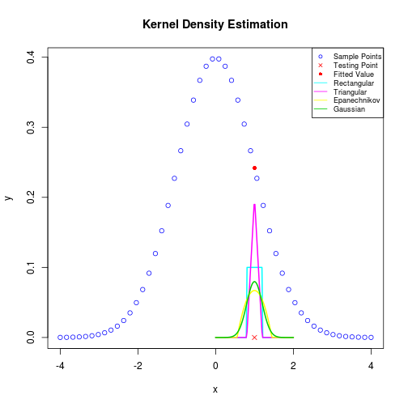
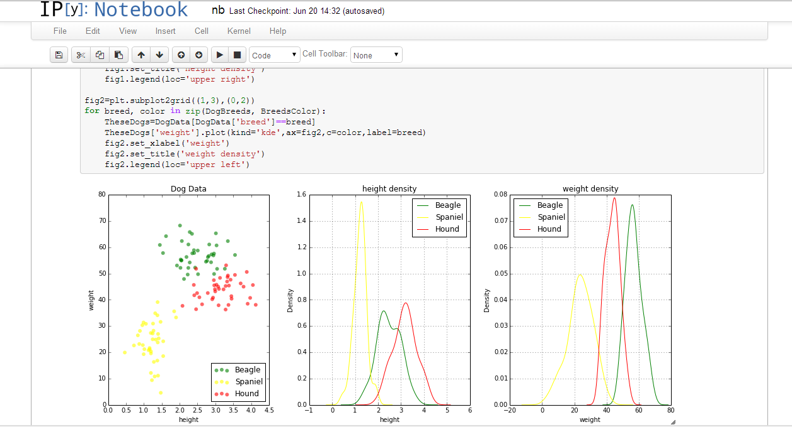

## Repository Checklists
<div class="columns-2">

- LDA&QDA
- Polynomial Regression
- Kernel Smoothing
- ARMA model
- R Markdown
- Naive Bayes


</div>

## LDA & QDA

<div class="centered">

</div>

## LDA & QDA

- Classification method.
- This is my first repo, in which I wrote a lot of math.
- Thanks for **Dallin** who ask me to provide some **hand-waving** description.

<div class="centered">

</div>

## Polynomial Regression

<div class="centered">

</div>

## Kernel Smoothing

<div class="centered">

</div>

## ARMA model

```{r echo = F, message = F, cache = F,include=FALSE}
options(RCHART_WIDTH = 600, RCHART_HEIGHT = 400)
knitr::opts_chunk$set(comment = NA, results ='asis', tidy = F, message = F)
```

```{r fig0, echo=FALSE}
require(rCharts)
n = 100
# Simulate the AR(1) model
x1 = 0
AR1=0
for(i in -50:n){
  a = rnorm(1)
  x1 = 0.5*x1+a
  if(i>1)
    AR1[i]=x1
}
# Simulate the MA(2) model
x1=0
a2=0
a3=0
MA2=0
for(i in -50:n){
  a1=rnorm(1)
  x1=a1+0.65*a2+0.24*a3
  a3=a2
  a2=a1
  if(i>0)
    MA2[i]=x1
}
# Plot the two series
Time=1:n
myTS=data.frame(Time,AR1,MA2)
m1 <- mPlot(x="Time", y = c("AR1","MA2"), type = 'Line', data = myTS ,parseTime=FALSE)
m1$set(pointSize = 0, lineWidth = 1)
m1$print('fig0', include_assets = TRUE, cdn = TRUE)
```

- Start to learn some interactive graphing package, like **rCharts**.

## R Markdown

<div class="centered">

</div>

- Used for creating dynamic documentation
- This presentation was made with R Markdown.
- R Markdown v2 was released last week. 

## Naive Bayes

After struggling with Python for two days...

<div class="centered">

</div>

## Naive Bayes

I finished my first python program



---

<div class="centered">
Thank you all for your help!


</div>

